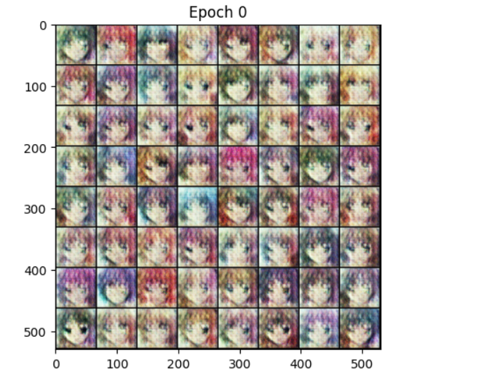
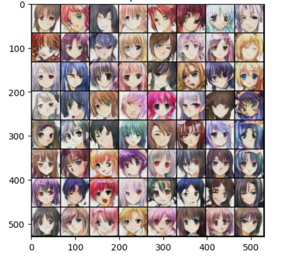

<div align="center">

# 🎨 Anime Face Generation using DCGAN

### Deep Convolutional Generative Adversarial Network · PyTorch · Kaggle

[](https://www.python.org/)
[](https://pytorch.org/)
[](https://www.kaggle.com/code/anchitchourasia/anime)
[](LICENSE)

**A complete DCGAN pipeline that learns to generate realistic anime faces from scratch — trained end-to-end on the Kaggle Anime Face Dataset.**

</div>

---

## 📸 Results

> From random noise at Epoch 1 → recognisable anime faces by Epoch 20

| Epoch 1 — Initial Noise | Epoch 20 — After Training |
|:---:|:---:|
|  |  |

The generator progressively learns facial structure, colour distribution, and anime-specific features — eyes, hair, and skin tones — purely from adversarial training with no labelled data.

---

## 📖 Table of Contents

- [Overview](#-overview)
- [Architecture](#-architecture)
- [Dataset](#-dataset)
- [Project Structure](#-project-structure)
- [Setup & Installation](#-setup--installation)
- [Running the Model](#-running-the-model)
- [Training Details](#-training-details)
- [Evaluation](#-evaluation)
- [Results Analysis](#-results-analysis)
- [Limitations & Future Work](#-limitations--future-work)
- [Tech Stack](#-tech-stack)
- [Author](#-author)

---

## 🧠 Overview

This project implements a **Deep Convolutional GAN (DCGAN)** to generate 64×64 pixel anime faces. GANs consist of two competing neural networks:

- **Generator (G)** — takes a random latent vector and generates a fake image.
- **Discriminator (D)** — classifies images as real (from dataset) or fake (from G).

Both networks train simultaneously in a minimax game. As D gets better at spotting fakes, G is forced to generate more realistic images. Over time, G learns the true distribution of anime faces well enough to fool D.

```
min_G  max_D  E[log D(x)] + E[log(1 − D(G(z)))]
```

where `x` is a real image and `z` is a random latent vector sampled from `N(0,1)`.

---

## 🏗️ Architecture

### Generator

Transforms a latent vector of size **100** into a **3×64×64** RGB image through transposed convolution (upsampling) layers.

```
Input:  z ∈ ℝ¹⁰⁰  (random noise reshaped to 100×1×1)

  ConvTranspose2d(100 → 512, k=4, s=1, p=0) + BatchNorm + ReLU   →  512×4×4
  ConvTranspose2d(512 → 256, k=4, s=2, p=1) + BatchNorm + ReLU   →  256×8×8
  ConvTranspose2d(256 → 128, k=4, s=2, p=1) + BatchNorm + ReLU   →  128×16×16
  ConvTranspose2d(128 →  64, k=4, s=2, p=1) + BatchNorm + ReLU   →   64×32×32
  ConvTranspose2d( 64 →   3, k=4, s=2, p=1)            + Tanh    →    3×64×64

Output: RGB image in range [-1, 1]
```

### Discriminator

Classifies a **3×64×64** RGB image as real or fake through strided convolution (downsampling) layers.

```
Input:  3×64×64 image (normalised to [-1, 1])

  Conv2d(  3 →  64, k=4, s=2, p=1)             + LeakyReLU(0.2)  →   64×32×32
  Conv2d( 64 → 128, k=4, s=2, p=1) + BatchNorm + LeakyReLU(0.2)  →  128×16×16
  Conv2d(128 → 256, k=4, s=2, p=1) + BatchNorm + LeakyReLU(0.2)  →  256×8×8
  Conv2d(256 → 512, k=4, s=2, p=1) + BatchNorm + LeakyReLU(0.2)  →  512×4×4
  Conv2d(512 →   1, k=4, s=1, p=0)              + Sigmoid         →  scalar

Output: Probability [0,1] that input is a real image
```

### Design Choices

| Component | Choice | Reason |
|---|---|---|
| Activation — G hidden | ReLU | Stable gradients in upsampling path |
| Activation — G output | Tanh | Maps output to `[-1,1]` matching normalised inputs |
| Activation — D | LeakyReLU (α=0.2) | Prevents dead neurons in downsampling path |
| Normalisation | BatchNorm | Stabilises GAN training, prevents mode collapse |
| Loss | BCELoss | Standard binary cross-entropy for real/fake labels |
| Optimiser | Adam (β₁=0.5, β₂=0.999) | β₁=0.5 recommended for GANs to avoid oscillation |

---

## 📦 Dataset

| Property | Value |
|---|---|
| **Name** | Anime Face Dataset |
| **Source** | [Kaggle — splcher/animefacedataset](https://www.kaggle.com/datasets/splcher/animefacedataset) |
| **Size** | ~63,000 anime face images |
| **Format** | JPEG / PNG |
| **Resolution** | Variable → resized to 64×64 during preprocessing |

### Preprocessing Pipeline

```python
transforms.Compose([
    transforms.Resize(64),          # Resize shorter edge to 64px
    transforms.CenterCrop(64),      # Crop to exact 64×64
    transforms.ToTensor(),          # Convert to [0,1] float tensor
    transforms.Normalize(           # Normalise to [-1,1] for Tanh output
        mean=(0.5, 0.5, 0.5),
        std=(0.5, 0.5, 0.5)
    )
])
```

---

## 📁 Project Structure

```
gan_anime/
│
├── gan_anime_faces.py       # Complete GAN pipeline — train + generate
├── requirements.txt         # Python dependencies
├── Initial_image.png        # Generated samples — Epoch 1 (baseline noise)
├── final_image.png          # Generated samples — Epoch 20 (trained output)
├── generator_v1.pth         # Saved Generator weights after training
└── README.md                # Project documentation
```

---

## ⚙️ Setup & Installation

### Prerequisites

- Python 3.8+
- CUDA-compatible GPU (strongly recommended) **or** Kaggle / Google Colab free GPU

### 1. Clone the Repository

```bash
git clone https://github.com/anchitchourasia/gan_anime.git
cd gan_anime
```

### 2. Install Dependencies

```bash
pip install -r requirements.txt
```

### 3. Download the Dataset

**Option A — Kaggle API (recommended)**

```bash
pip install kaggle
kaggle datasets download -d splcher/animefacedataset
unzip animefacedataset.zip -d ./data/
```

**Option B — Manual download**

1. Visit [https://www.kaggle.com/datasets/splcher/animefacedataset](https://www.kaggle.com/datasets/splcher/animefacedataset)
2. Download and extract the dataset.
3. Update `dataset_path` in `gan_anime_faces.py` to point to your local images folder.

---

## 🚀 Running the Model

### Train from Scratch

```bash
python gan_anime_faces.py
```

> **Note:** The default `dataset_path` is set to the Kaggle notebook path:
> ```python
> dataset_path = '/kaggle/input/datasets/splcher/animefacedataset/images'
> ```
> For local runs, update it to your extracted dataset location:
> ```python
> dataset_path = './data/images'
> ```

### Run on Kaggle (Recommended)

Full trained notebook with all outputs is publicly available:

👉 **[View Live Kaggle Notebook](https://www.kaggle.com/code/anchitchourasia/anime)**

---

## 🔧 Training Details

| Hyperparameter | Value |
|---|---|
| Latent vector size (z) | 100 |
| Image size | 64 × 64 px |
| Batch size | 128 |
| Epochs | 20 |
| Learning rate | 0.0002 |
| Adam β₁ | 0.5 |
| Adam β₂ | 0.999 |
| Loss function | BCELoss |
| Device | CUDA (GPU) / CPU fallback |

### Training Loop — Two-Step Update

**Step 1 — Train Discriminator**
```
Maximise: log D(real) + log(1 − D(G(z)))
```
- Forward real images with label `1.0` → compute `errD_real`
- Generate fakes from noise → forward with label `0.0` → compute `errD_fake`
- Backpropagate `errD_real + errD_fake`, update D

**Step 2 — Train Generator**
```
Maximise: log D(G(z))
```
- Pass fakes through updated D with label `1.0` → compute `errG`
- Backpropagate `errG`, update G only

**Console output per epoch:**
```
Epoch [1/20]   Loss_D: 0.8321   Loss_G: 1.2547
Epoch [2/20]   Loss_D: 0.6812   Loss_G: 1.5390
...
Epoch [20/20]  Loss_D: 0.4231   Loss_G: 2.1083
Training complete. Model saved.
```

---

## 📊 Evaluation

### Visual Progression

| Stage | Observation |
|---|---|
| Epoch 1 | Pure noise — generator has learned nothing |
| Epoch 5 | Rough colour clusters and vague shapes emerging |
| Epoch 10 | Facial outlines and eye regions becoming visible |
| Epoch 20 | Clear anime-style faces with eyes, hair, and skin tones |

### Qualitative Metrics

| Indicator | Result |
|---|---|
| Facial structure | ✅ Visible by epoch 5 |
| Eye detail | ✅ Emerging by epoch 10 |
| Hair & colour variation | ✅ Consistent by epoch 20 |
| Mode collapse | ✅ Not observed |
| Training stability | ✅ Both losses converge without divergence |

> **Future:** Quantitative evaluation using **Fréchet Inception Distance (FID)** via `torchmetrics` is planned to numerically compare real vs generated image distributions.

---

## 📈 Results Analysis

The generator shows clear progression across 20 epochs. Early epochs produce incoherent noise; mid-training reveals rough facial structure; by epoch 20, outputs show consistent anime-style faces with varied hair colours, distinct eyes, and proper skin tone distribution.

The adversarial training dynamics remained stable throughout — neither network dominated overwhelmingly, which represents the desired equilibrium for GAN convergence.

---

## ⚠️ Limitations & Future Work

### Current Limitations
- Output resolution capped at **64×64** — fine details are limited.
- Only **20 training epochs** — more epochs would improve fidelity.
- No quantitative FID/IS metric computed yet.
- Dataset path hardcoded for Kaggle — requires manual update for local runs.

### Planned Improvements
- [ ] Train for 50–100 epochs with learning rate scheduling
- [ ] Add **Spectral Normalisation** on Discriminator for improved stability
- [ ] Implement **Progressive Growing GAN (ProGAN)** for higher resolution (128×128, 256×256)
- [ ] Compute **FID score** using `torchmetrics` + `torch-fidelity`
- [ ] Explore **Conditional GAN (cGAN)** to control attributes like hair colour and eye style
- [ ] Add data augmentation (random horizontal flip, colour jitter)

---

## 🛠️ Tech Stack

| Tool | Purpose |
|---|---|
| [PyTorch](https://pytorch.org/) | Model building, training, GPU acceleration |
| [Torchvision](https://pytorch.org/vision/) | Image transforms, dataset utilities |
| [Pillow (PIL)](https://python-pillow.org/) | Image loading and format handling |
| [Matplotlib](https://matplotlib.org/) | Visualising generated image grids |
| [Kaggle Notebooks](https://www.kaggle.com/) | Cloud GPU training environment |

---

## 👤 Author

**Anchit Chourasia**

[](https://www.kaggle.com/anchitchourasia)
[](https://github.com/anchitchourasia)

---

## 📄 License

This project is licensed under the **MIT License** — free to use, modify, and distribute with attribution.

---

<div align="center">
<sub>Built as part of the Gen AI Intern Assessment · Quantum IT Innovation</sub>
</div>
